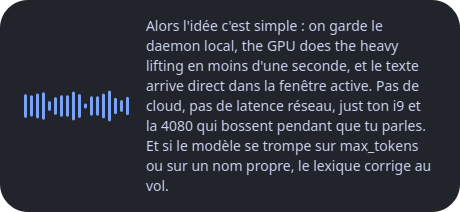
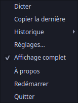
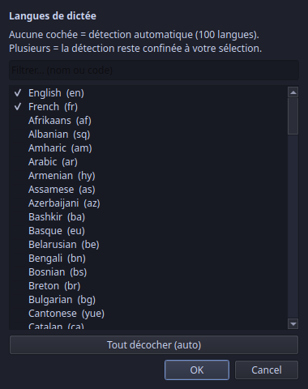

# TuParles

[](https://github.com/PLNech/TuParles/actions/workflows/ci.yml)
[](LICENSE)

Local, private, push-to-talk dictation for people who code-switch entre le
français and English mid-sentence — and need their tech vocab (`max_tokens`,
KPIs, la contingence) to survive transcription.

Tap **Right Ctrl+Alt** → a small floating bubble appears with a live waveform
and the transcript streaming in as you speak → release (or tap again) → the
text is typed into whatever window has focus. Everything runs on-device.

<p align="center">
  
</p>

| Vue complète (toggle dans le menu) | Le perchoir | Réglages |
|:---:|:---:|:---:|
|  |  |  |

*(screens rendered from the actual widgets by `scripts/readme_screens.py` —
regenerate with `QT_QPA_PLATFORM=offscreen poetry run python scripts/readme_screens.py`)*

## Features

- **Live transcript** — while you speak, the bubble streams a ~1 Hz greedy
  preview of the last few seconds; on stop, the whole take gets a full
  beam decode. On a long take that final pass runs batched (VAD-chunked,
  parallel on GPU): a 3-minute monologue lands in about a second.
- **Code-switching first-class** — by default the model auto-detects among
  100 languages per take. In *Réglages* you can confine detection to your
  own set: one language forces it; several turns on **per-segment**
  detection, so the language is re-detected segment by segment and a
  mid-sentence switch from français to English survives intact ("can I
  switch to English" stays English, instead of becoming "peux-je changer en
  anglais"). No more random Cyrillic cameos when you mumble, either.
- **Fast delivery, X11 and Wayland** — short takes are typed into the focused
  window (X11 xdotool, modifier-safe); long ones are pasted (Ctrl+V, or
  Ctrl+Shift+V in terminals). On Wayland (GNOME) everything is pasted via
  ydotool (never typed — ydotool assumes a US keymap). The clipboard is
  always set as backup.
- **Cleanup that knows its place** — spoken punctuation ("virgule",
  "point", "new line") in both languages, a personal lexicon for your
  jargon, and deterministic collapse of Whisper repetition loops. No AI
  rewriting: a visible mishear beats a confident wrong autocorrect.
- **History & stats, local forever** — every take lands in SQLite with
  its telemetry (duration, decode time, words/min, detected language).
  `tuparles history "query"` searches it; `tuparles stats` shows your
  dictation profile (débit, decode speed, language mix).
- **Analytics dashboard, all on your box** — a tray *Analytics…* window
  with three views: *Ton usage* (which voice commands and syntax features
  you actually use, and which you've never discovered), *Ta voix* (a tag
  cloud + keyphrases over your dictation history), and *Ton code* (the
  cached codebase analysis that seeds the decoder). Feature usage is
  tracked **locally and opt-out** — nothing leaves the machine; toggle it
  off or wipe it in *Réglages › Confidentialité*.
- **PII firewall — minimize before persist** — what you dictate is always
  pasted verbatim, but the *stored* copy is cleaned first: secrets and
  checksum-validated identifiers (IBAN, n° de sécu, credit card, API keys)
  are masked with a `<KIND>` placeholder before they ever reach
  `history.db`. High-precision detection only, so it destroys ~zero real
  text; on by default, a toggle in *Réglages › Confidentialité*. The
  analytics tag cloud also honours a frequency floor so a once-spoken name
  can be kept from surfacing. A *Pare-feu PII* editor adds your own terms
  in two tiers — **block** (masked, for confidential project/client names)
  and **alert** (surfaced, never auto-erased) — case- and accent-insensitive.

## Architecture

```
            hotkey (Right Ctrl + Right Alt)
                          │
   mic ── 16 kHz mono ────┤
    │                     ▼
    │              ┌─────────────┐   final: batched beam   ┌─────────────────────┐
    ├─ levels ───► │   daemon    │ ──────────────────────► │ faster-whisper      │
    │              │  (Python)   │ ◄────────────────────── │ large-v3-turbo fp16 │
    ▼              └─────────────┘   partials: ~1 Hz greedy │ (GPU, persistent)   │
 waveform              │      │                            └─────────────────────┘
  bubble UI ◄──────────┘      ├─► punctuation → lexicon → repeat-collapse
  (live transcript)           ├─► type/paste into focus (X11 xdotool · Wayland ydotool) + clipboard
                              └─► history + telemetry + usage events (SQLite)
```

- **Primary engine**: [faster-whisper](https://github.com/SYSTRAN/faster-whisper)
  `large-v3-turbo` in float16, persistent on the GPU (~29x realtime
  measured on an RTX 4080). Finals go through the batched pipeline;
  partials are cheap greedy decodes of a sliding window.
- **CPU fallback**: [Qwen3-ASR-0.6B](https://huggingface.co/Qwen/Qwen3-ASR-0.6B)
  via [antirez/qwen-asr](https://github.com/antirez/qwen-asr), a pure-C
  inference engine (OpenBLAS) — used automatically when no GPU answers
  (waveform-only bubble, no live partials).
- **Self-healing GPU**: if the CUDA context dies mid-session — a laptop
  suspend/resume is the classic culprit, leaving `nvidia-smi` happy but
  CUDA unusable — the engine rebuilds the context on the next take, and
  only drops to the CPU fallback if that also fails. A take never silently
  yields nothing.

## Install

One-liner (Ubuntu/Debian, X11 — needs git + poetry; Wayland adds one step, below):

```bash
curl -fsSL https://github.com/PLNech/TuParles/releases/latest/download/install.sh | bash
```

This pulls the repo, installs system + Python deps, builds the CPU fallback
engine, downloads the model weights, and registers TuParles in GNOME search.

<details>
<summary>Manual setup</summary>

```bash
sudo apt install libopenblas-dev xdotool xsel libportaudio2 ffmpeg
git clone https://github.com/PLNech/TuParles && cd TuParles
poetry install
git clone --depth 1 https://github.com/antirez/qwen-asr vendor/qwen-asr
make -C vendor/qwen-asr blas
# model weights: see install.sh for the five files to fetch into models/
cp vocab.example.txt vocab.txt           # then add your own names/jargon
bash scripts/install_desktop.sh          # GNOME launcher (optional)
poetry run tuparles
```

</details>

GPU (any recent NVIDIA card) is detected automatically and used for the
primary faster-whisper engine; without one, the C fallback engine
transcribes on CPU.

### Wayland (GNOME)

Same install, then this once — and log out and back in afterwards:

```bash
bash scripts/setup_wayland.sh   # input group · uinput rule · wl-clipboard/ydotool · GNOME extension
```

Other Wayland compositors fall back to Ctrl+V (no terminal detection without
the GNOME extension); the X11 path also works under XWayland.

## Personal glossary

Copy `vocab.example.txt` to `vocab.txt` and put your recurring names and
jargon there — it biases decoding toward your vocabulary. The file stays
local (gitignored), like everything you dictate.

Better: let your own dictations grow it. `tuparles vocab suggest` mines
your history for recurring technical tokens and proper nouns;
`tuparles vocab review` walks you through them one by one (oui/non) and
appends the keepers. You approve every word — suggestions never auto-apply,
because a glossary that grows on its own is just autocorrect with extra
steps. Changes take effect on the next take, no restart.

## CLI

```bash
tuparles                  # start the daemon (or launch from GNOME search)
tuparles history          # last 20 takes
tuparles history "tokens" # search your dictations
tuparles stats            # local telemetry: takes, débit, decode speed, language mix
tuparles vocab suggest    # mine your history for glossary candidates
tuparles vocab review     # accept/reject them interactively
tuparles report "bug…"    # open a prefilled GitHub issue (no account data sent)
```

Everything lives in `~/.local/share/tuparles/history.db` and
`~/.config/tuparles/settings.json` — yours, on disk, never synced anywhere.
