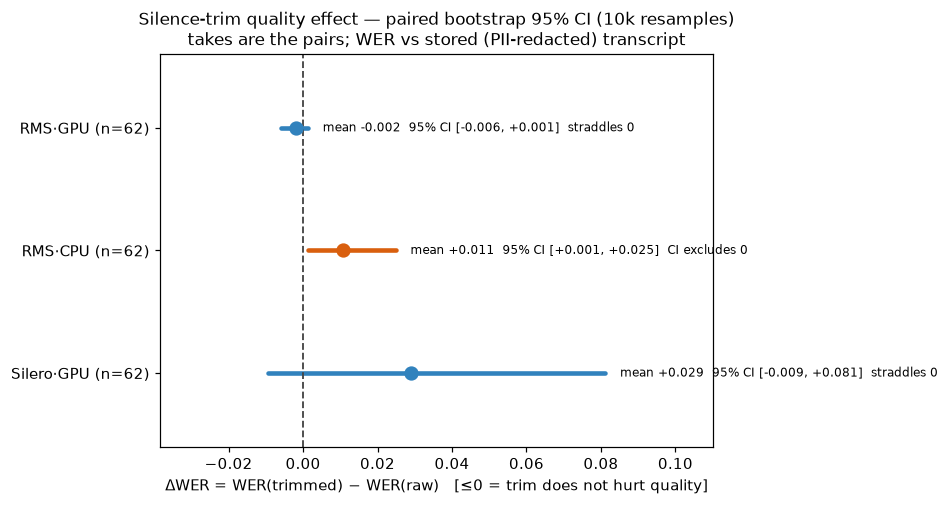
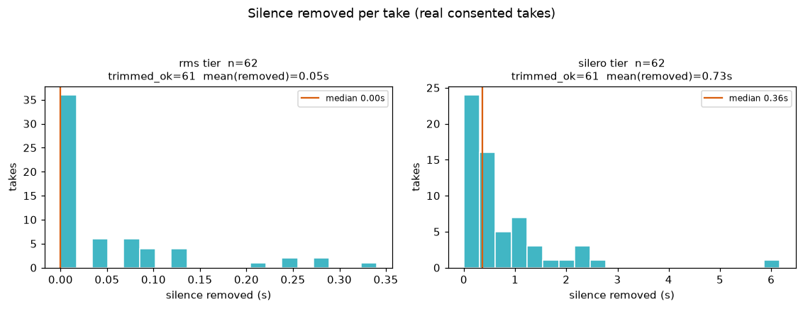
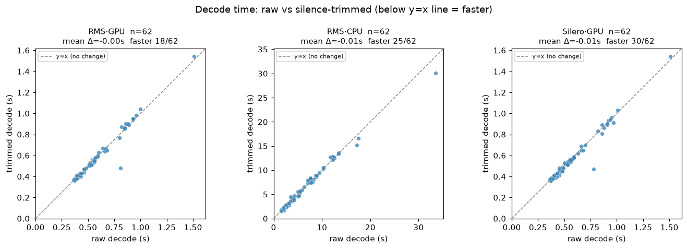

# Audio preprocessing: trim the tail, don't touch the noise

*2026-07-11 — synthesis of a two-track investigation: SOTA survey (web) +
codebase audit. Seeds the preprocessing extension design.*

## The problem as reported

Users leave the mic keyed for seconds after they stop speaking; the silent
tail inflates decode time. Background music/noise separation was also floated
as a possible quality win.

## Finding 1 — the silent tail is real, but it's a *CPU-path* problem

The GPU path already skips silence: `GpuEngine.transcribe` decodes through
faster-whisper's `BatchedInferencePipeline` with `vad_filter=True`
(`engine.py:143-157`), which runs silero-vad over the full buffer and
feature-extracts only the speech chunks. The fallback rungs do not:

| Path | normalize_audio | VAD | Silent-tail cost |
|---|---|---|---|
| `GpuEngine` (final + partial) | yes | yes | mitigated internally |
| `WhisperCppEngine` | yes | **no flag passed** (`engine.py:422-426`) | full |
| `QwenCpuEngine` | **bypassed entirely** (`engine.py:306-348`) | none | full, pushes toward the hard 120s subprocess timeout |
| `filetranscribe.py` | **bypassed** | yes (`filetranscribe.py:235`) | mitigated |

So the feature that motivated this ("my decode takes too long when I forget
the mic on") pays off most exactly where the house doctrine cares most: the
CPU/train/battery story.

Two caveats that make pre-trim worthwhile even on GPU:

- faster-whisper's VAD defaults are conservative (`min_silence_duration_ms=2000`)
  — a 0.5-1.5s dead tail sails through. Our own
  `2026-07-08-cpu-asr-sota-and-decode-review.md` already proposed tuned
  `VadOptions` (500ms / `speech_pad_ms=200`); still unshipped.
- Whisper-family encoders cost ~constant per 30s window; trimming saves
  *window count*, a discrete win (45s take with a 20s tail: 2 windows → 1).
  Bonus: silence is the classic hallucination trigger ("Sous-titres par la
  communauté d'Amara.org") — trimming is also a correctness measure.

### Field forensics (2026-07-11) — the "GPU freeze" was the qwen rung

A perceived "GPU froze after a long take, partials flowed then a long wait
before paste" was checked against the journal + history DB (numeric columns
only). Every take from 07-09 to 07-11 12:49 ran on `QwenCpuEngine` (CUDA
presumably wedged post-suspend; a restart at 13:54 recovered `GpuEngine`).
The worst case: 51.2s audio → 20.8s decode + 0.8s lock + 1.9s deliver ≈ 23.5s
of dead air. Same day on healthy GPU: 34.8s audio → 1.0s decode. Partials
felt live because the small partials model kept up; the *final* full-buffer
qwen decode paid the whole price. This is the strongest real-world case for
trimming at capture handoff: the CPU rung decodes every silent second.

## Finding 2 — denoising before Whisper is evidence-against, not just unproven

The existing `preprocess.py` docstring ("we deliberately do NOT denoise")
survives contact with 2025-2026 literature, and then some:

- [arXiv:2512.17562](https://arxiv.org/abs/2512.17562): 500 recordings × 9
  noise conditions × 4 ASR models × MetricGAN+ enhancement — original noisy
  audio beat enhanced audio in **40/40 configurations**, even at mild SNR.
- [arXiv:2603.04710](https://arxiv.org/abs/2603.04710): SAM-Audio denoising
  before Whisper consistently raised WER despite better PSNR — and hurt
  *large* models more than small ones.
- Mechanism ([arXiv:2404.14860](https://arxiv.org/abs/2404.14860)):
  enhancement artifacts (musical noise, spectral holes) damage ASR more than
  the noise they remove. Whisper trained on 680k h of noisy web audio
  precisely so it wouldn't need a cleanup front-end.
- The only positive results use enhancement co-trained with the recognizer
  ([arXiv:2403.06387](https://arxiv.org/abs/2403.06387)) — not applicable to
  a frozen checkpoint.

demucs is the wrong tool class (music-stem separation, GPU-heavy);
DeepFilterNet is licence-clean (MIT/Apache-2.0, verified) but last released
Aug 2023; RNNoise (`pyrnnoise`) is the only candidate we'd ever consider,
strictly opt-in and eval-gated. **Default: no noise path.**

## Design — where the trim hooks in

**Hook at capture handoff, not per-engine.** Trim the buffer once where
`Recorder.stop()` returns it / where `_QueuedTake` is built
(`daemon.py:307-337`), so GPU, whisper.cpp, qwen, and any future engine get
it for free — which also fixes the qwen normalize-bypass as a side effect.
Invariant: never mutate `Recorder._chunks` (live capture) — trim only the
returned copy. Partials are safe: preprocess already runs per-decode-call on
tail-window snapshots (`daemon.py:269`), non-destructively.

**Trim mechanism, GPU-or-CPU by construction:**

- Primary: **silero-vad batch API** (`get_speech_timestamps`), ONNX CPU
  runtime, MIT, ~0.6% RTF (165× realtime on one core) — same cheap path on
  both legs, no CUDA anywhere in the step.
- Fallback (silero unavailable/broken): deterministic RMS tail-trim
  (librosa-style `top_db`, self-implemented to avoid the dep). Trailing
  silence after speech is the *easy* one-sided case; energy thresholding is
  honest work there.
- Padding: keep **~200ms pre-roll / 300-500ms post-roll** margins around
  detected speech (silero's 30ms default pad is tuned for telephony, not
  ASR). Cap interior pauses rather than deleting all pause structure.
- "It's a setting": `trim_silence` on by default, Réglages toggle
  (`Couper les silences en début/fin de prise`), pad margins as tunables.

**Complement:** pass tuned `VadOptions` to the faster-whisper call sites
(the D-series item from 2026-07-08) — pre-trim and in-decode VAD are
complementary, not redundant.

## Validation gate (before the default flips on)

- **Real takes**: `scripts/replay_takes.py` A/B (trim on/off) over stored
  take WAVs — WER drift per take + `decode_s` delta. Respect the
  review_takes consent gate.
- **Codeswitch corpus**: `tests/data/codeswitch/` slot-check gate must stay
  green; WER via paired comparison, **report a bootstrap 95% CI on ΔWER**,
  not a bare point estimate — at n≈dozens only large effects are detectable,
  and we say so.
- **Structural clip check**: duration-delta + false-clip rate (trimmed span
  vs expected speech span) as a WER-independent safety metric.
- **Success metric already instrumented**: `decode_x_realtime` in
  `history.summarize()` (`history.py:177-180`) and the per-take journal line
  (`audio_s` vs `decode_s`, `daemon.py:428-434`) — before/after is measurable
  with zero new plumbing.

## Ruled out (and why)

- webrtcvad: dead upstream; ~50% TPR vs silero's ~88% at 5% FPR.
- pyannote segmentation: offline diarization tool, wrong weight class.
- TEN VAD: plausible marginal RTF win, unproven; not worth a second VAD dep.
- demucs / MP-SENet / diffusion SE: wrong tool or research-stage.
- Generic denoising by default: actively harmful per 40/40 sweep above.

## Implemented (2026-07-11, #131)

Shipped exactly the design above. `trim_silence` (preprocess.py) trims lead/tail
only, three-tier (silero-vad in the optional `trim` poetry group → deterministic
RMS `top_db`-style fallback → no-op), never raises, keeps 200 ms / 400 ms
margins, and bails to the untrimmed buffer if the result is under 0.5 s or more
than 95 % would be removed. Hooked at capture handoff (`daemon._stop_and_enqueue`),
so every engine gets the shorter buffer and the qwen normalize-bypass is closed
as a side effect. The wider factorization landed too: one `prepare_pcm` seam
(int16→float32 + normalize) now serves the GPU, whisper.cpp, qwen AND the offline
file path (qwen used to skip normalization entirely). Tuned `VadOptions`
(`min_silence_duration_ms=500`, `speech_pad_ms=200`, `max_speech_duration_s=30`,
verified against faster-whisper 1.2.1's `VadOptions` fields) replaced the bare
`vad_filter=True` at all four faster-whisper call sites. The CPU-fallback tray
signal is now persistent (a desaturated idle blue), so a suspend-wedged CUDA
context can't hide behind a neutral idle glyph.

Note on the primary tier: silero-vad was **not** installed in the build
environment (it's the optional `trim` group), so the shipped default path here is
the RMS fallback; the silero tier is API-verified against silero-vad v5
(`load_silero_vad(onnx=True)` + `get_speech_timestamps`) but not exercised live.

### Real-take A/B (2026-07-11, n=62 consented takes, numbers only)

The consent review closed (62 `share_ok=1` takes, all with WAVs) and the full
A/B ran: both trim tiers (RMS fallback, silero-vad) × both engines, WER vs the
stored redacted transcript, paired bootstrap 95% CI (10k resamples).

| Cell | n | ΔWER mean | 95% CI | Δdecode (mean/median) |
|---|---|---|---|---|
| RMS · GPU | 62 | −0.002 | [−0.006, +0.001] | ~0 |
| RMS · qwen-CPU | 62 | +0.011 | [+0.001, +0.025]* | ~0 |
| silero · GPU | 62 | +0.029 | [−0.009, +0.081] | ~0 |
| silero · qwen-CPU | 3 | — | run aborted (see caveats) | — |

\* The RMS·CPU CI excluding zero is a **decode-variance artifact, not trim
harm**: 7 of the 13 moved takes had <0.05 s trimmed (essentially untouched
audio), including the biggest mover (+0.36 on 0.04 s trimmed) — qwen decode is
non-deterministic. Median ΔWER = 0.000.

**What each tier actually removes** — the corpus verdict on "dead air":
RMS finds almost nothing (median 0.00 s, max 0.34 s — the recorder already
captures speak-to-release tightly); silero finds the real thing (median
0.36 s, mean 0.73 s, max **6.17 s**).

**Safety gates behaved as designed**: the one 0.50 s take was protected by
both tiers (min-result bail / silero no-speech); the >95 %-removed gate never
fired.

**The one real defect found — short takes trimmed below ~1 s.** Two takes
(raw 1.3 s / 1.4 s, silero-trimmed to 0.76 s / 0.99 s) went from perfect to
fully wrong: whisper-turbo is unreliable on sub-1 s clips. They passed the
0.5 s floor but not the decoder's reliability threshold. Counter-evidence the
trim helps when there's something to trim: the take with the largest removal
(6.17 s) *improved* WER by −0.34.

**Verdict vs the shipping gate ("trim must not damage quality"):**
- **RMS tier: PASS — but a near-no-op** on real takes (nothing to remove), so
  no decode win either. Safe as the always-available fallback.
- **silero tier: CONDITIONAL.** Aggregate CI straddles zero, it removes real
  silence, but the two short-take blowups are structural, not noise. Fix in
  the house style (asymmetric safety): **raise `TRIM_MIN_RESULT_S` to
  ~1.0–1.5 s, or skip trimming when the raw take is already short.** That
  removes the only observed damage.
- **The decode payoff remains unproven where it matters** (silero × qwen-CPU,
  the forgotten-mic case): that leg crashed on per-decode timeouts under heavy
  external CPU load (12–34 loadavg from concurrent agents + the live daemon)
  — load-confounded, honestly excluded rather than reported. The synthetic
  table below stands as the direction-and-magnitude evidence for that leg.

**Caveats (calibrated):** WER is vs redacted transcripts (a fixed noise floor
common to all cells); silero·CPU is n=3 → excluded; decode wins on GPU are
negligible by construction (in-decode VAD already skips silence).

**Doctrine note — the `trim` group is not as lean as promised**: the lock pins
`silero-vad==6.2.1`, which hard-depends on torch + the full CUDA wheel stack
(~GB on disk) even though inference runs via onnxruntime-CPU
(`load_silero_vad(onnx=True)` verified). Either pin an older onnx-only
package, vendor the ONNX model + a thin wrapper, or accept the disk cost with
eyes open — the pyproject comment currently overpromises.

### Synthetic decode-time A/B (mechanism check, PII-free)

To validate the *decode-time* mechanism without user audio, a synthetic PII-free
A/B (amplitude-modulated noise as a speech stand-in + a silent tail, decode timed
raw vs trimmed) reproduces the field case in miniature:

| Engine | tail removed | decode raw → trimmed | Δdecode |
|---|---|---|---|
| qwen-CPU | 4.6 s | 12.90 → 8.52 s | −4.38 s |
| qwen-CPU | 14.6 s | 17.98 → 9.22 s | −8.75 s |
| qwen-CPU | 24.6 s | 20.69 → 8.38 s | **−12.31 s** |
| GPU (turbo) | 4.6–24.6 s | ~0.5 → ~0.4 s | ~−0.15 s (mean) |

The CPU rung's decode time scales with buffer length, so trimming a forgotten-mic
tail is close to linear savings (the 24.6 s case ≈ the reported 51 s→20.8 s field
take, scaled). The GPU is ~neutral: its in-decode VAD already skips silence — the
trim is a CPU-path win, exactly Finding 1. Caveat (calibrated): n=3, one synthetic
signal, no WER (synthetic audio has no ground truth); read as *direction and
magnitude of the decode-time effect*, not a WER verdict. The WER-no-harm claim
still needs the consented real-take A/B.
