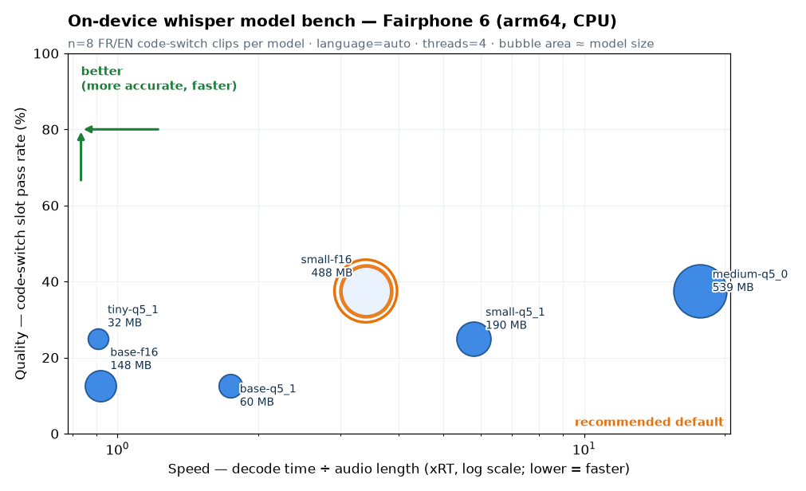
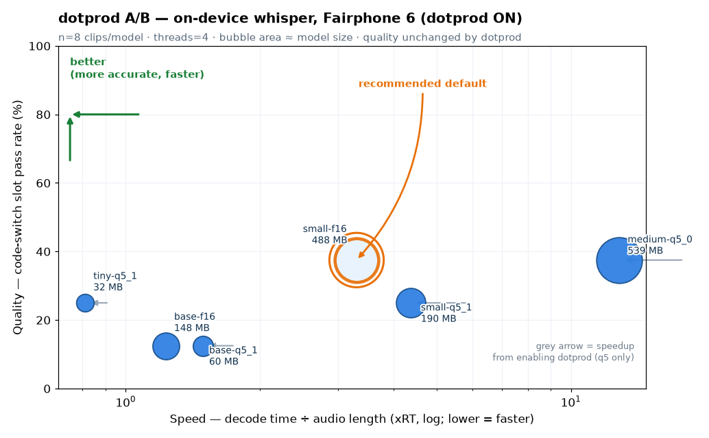

# On-device whisper model bench — picking the Android daily default (#13)

**Date:** 2026-07-22 · **Device:** Fairphone 6 (arm64, Dimensity 7300, CPU only)
· **Issue:** [#13](https://github.com/PLNech/TuParles/issues/13)

## Context

The Android app bundles `ggml-base` (f16). Issue #13 framed the model choice as a
ladder with a hole in the middle: `base` is fast but fumbles tech vocab
(~1.5s per 4s clip, misses like "fan out" → "fais un air"), `large-v3-turbo` is
effectively flawless but slow (30-44s per clip). Everything between `base` and
`large-v3-turbo` was untested on the real target. This bench fills that gap:
six models decoded on the phone against the committed FR/EN code-switch corpus,
measuring decode wall time and transcript quality.

## Method

- **Models:** `tiny-q5_1`, `base-q5_1`, `base` (f16, current bundle),
  `small-q5_1`, `small` (f16), `medium-q5_0` — from
  [ggerganov/whisper.cpp](https://huggingface.co/ggerganov/whisper.cpp).
- **Clips:** n = **8** code-switch clips per model (48 decodes total), from the
  committed corpus (`tests/data/codeswitch/`), 16 kHz mono PCM16, neural (piper)
  TTS, 4 French-accent + 4 English-accent, spanning en-verb-borrow, homophone,
  acronym, numbers-switch, mid-sentence-switch and compound-borrow cases.
- **Engine:** a standalone `whisper-cli` built from the vendored whisper.cpp
  **1.9.1**, using the **same decode params as the app's JNI path** (`jni.c`:
  GREEDY, `no_context`, `language=auto`).
- **Build flags — the fidelity choice that matters:** NDK 27.1.12297006,
  arm64-v8a, **Release / -O3** (a -O0 ggml build is 10-50x slower), and
  `-march=armv8.2-a+fp16` to **mirror the shipping app exactly**. We deliberately
  did **not** enable `+dotprod`, because the app does not ship it. That decision
  turns out to dominate the results (see below).
- **Timing:** on-device wall clock (`date +%s%N`, delta via on-device `bc` — the
  device shell does 32-bit arithmetic and overflows a 19-digit nanosecond epoch).
  `THREADS=4`, fixed across models for a fair comparison.
- **Quality:** the repo's own scorer (`tuparles.eval.score_case`): the slot check
  (must-contain tokens present, must-not-contain absent) is the gate; word error
  rate ([WER](https://en.wikipedia.org/wiki/Word_error_rate)) is the trend. We
  score the **raw** engine output (no desktop `pipeline.postprocess`), since the
  Android engine has no such Python post-step. `xRT` = decode time ÷ audio length
  (lower is faster; <1 is faster than real time).

## Results

| model | size | mean ms | median ms | ms sd | mean xRT | slot pass | mean WER | WER sd |
|---|--:|--:|--:|--:|--:|:--:|--:|--:|
| tiny-q5_1 | 31 MB | 3215 | 3388 | 391 | 0.91 | 2/8 (25%) | 0.625 | 0.20 |
| base-q5_1 | 57 MB | 6062 | 6406 | 782 | 1.74 | 1/8 (12%) | 0.613 | 0.23 |
| **base-f16** (current) | 142 MB | 3211 | 3223 | 134 | 0.92 | 1/8 (12%) | 0.608 | 0.25 |
| small-q5_1 | 182 MB | 20293 | 20694 | 1654 | 5.79 | 2/8 (25%) | 0.532 | 0.23 |
| **small-f16** (pick) | 466 MB | 11953 | 12189 | 1214 | 3.41 | 3/8 (37%) | 0.523 | 0.25 |
| medium-q5_0 | 515 MB | 61981 | 61860 | 7823 | 17.74 | 3/8 (37%) | 0.491 | 0.22 |

## Reading the numbers — what is signal, what is noise at n=8

- **Speed ordering is hard signal.** The per-clip spread is small (ms sd is a few
  percent of the mean), the ordering is stable across all 8 clips, and the gaps
  between models are large multiples. Trust the speed numbers.
- **The WER *gradient* (tiny → small → medium) is signal; adjacent-model WER gaps
  are noise.** WER sd is ~0.20-0.25 at n=8 — larger than the ~0.02-0.10 gap
  between neighbouring rows. So "medium (0.491) beats small-f16 (0.523)" is
  **not** a distinguishable difference at this sample size; "small beats base by
  ~0.08" is a real, monotonic trend but its margin is soft. Report it as a
  direction, not a decimal.
- **Absolute slot pass-rates are low (12-37%) and coarse.** We score raw output
  against an adversarial homophone corpus with no lexicon/postprocess, so these
  are a *relative* stress signal between models, not the accuracy a user sees
  (the app's post-decode path lifts them). A 1-case move (1/8 → 2/8) is within
  noise. The safe read: small/medium clear the bar roughly twice as often as
  base — consistent with the WER trend, not independent confirmation.

## The headline finding: on this build, f16 beats quantized

The build ships `+fp16` but not `+dotprod`. Without the dot-product kernel, the
int8 path that q5 models rely on falls back to a slower route, while fp16 matmul
is hardware-accelerated. The result inverts the usual "quantized is faster and
smaller" intuition, consistently across both families and all 8 clips:

- `base-f16` is **~1.9x faster** than `base-q5_1` (3.2s vs 6.1s) at equal quality.
- `small-f16` is **~1.7x faster** than `small-q5_1` (12.0s vs 20.3s) at equal-or-
  better quality.

So on the **current app build**, `base-q5_1` and `small-q5_1` are strictly
dominated: slower than their f16 sibling for no quality gain. They should not be
offered until dotprod is enabled — at which point the ranking may flip entirely
(the biggest open follow-up, below).

## Recommendation

**(a) Daily-driver default: `small-f16`.** It is the sweet spot #13 was after —
the best measured quality (lowest WER, highest slot pass) at ~3.4x real time
(~12s for a ~3.5s clip), still usable for push-to-talk dictation. `medium-q5_0`
buys no distinguishable quality (WER gap within noise) for **5x** the latency
(~62s/clip), so it is not the daily driver. `base-f16` stays the fast, light
fallback — but it is exactly the model #13 complains about, so it should not
remain the *only* option. Per house doctrine this is **"a setting"**: `small-f16`
as the recommended default, `base-f16` one tap away for speed-first users on
weaker phones.

**(b) Download-picker lineup for the lean-APK work (#13 / app-weight goal).**
Ship a lean APK and let the user pull a model along a speed↔quality ladder,
dropping the dominated q5 rungs:

| rung | model | size | character |
|---|---|--:|---|
| fastest | tiny-q5_1 | 31 MB | roughest; near real time |
| light default | base-f16 | 142 MB | near real time; fumbles tech vocab |
| **recommended** | **small-f16** | 466 MB | best balance; ~3.4x real time |
| most accurate | medium-q5_0 | 515 MB | slow (~18x); for offline/batch |
| flawless | large-v3-turbo | ~547 MB | slowest; existing option |

(`tiny-q5_1` stays as a q5 rung because at tiny size there is no f16 sibling in
the lineup and its footprint is the whole point.)

## Open follow-ups

1. **dotprod A/B (highest priority).** ✅ **Resolved 2026-07-23 — see the A/B
   section below.** Short answer: dotprod speeds q5 by 1.1-1.4x with no quality
   change, but does **not** flip the f16-faster-than-q5 ranking. It does make the
   smaller q5 models fast enough to be viable download-picker rungs.
2. **Thread-count sweep.** ✅ **Coarsely resolved 2026-07-23 (A/B section).**
   More threads than the 4 big cores do not help and hurt q5 (t=8 ~1.5x worse on
   small-q5_1). Keep `THREADS=4`. A finer sweep (t=2/3, big-core pinning) is still
   open but the ceiling is at/below 4.
3. **Grow n and score post-processed output.** n=8 gives wide WER error bars.
   Add clips and also score through the app's post-decode path to estimate
   user-visible accuracy, not just raw-engine stress.

## Reproducing

Kit (scripts, built arm64 `whisper-cli`, models, clips, scorer, chart): see the
session's bench-kit. One command with the phone connected:
`./run-bench.sh && python3 score.py && python3 chart.py small-f16`. Total device
run: 48 decodes in ~15 min.

---

## A/B: dotprod (2026-07-23)

**Verdict: enabling `+dotprod` speeds up the q5 models by 1.1-1.4x (larger models
gain more) with no measurable quality change, but does NOT flip the ranking —
f16 stays faster than its q5 sibling. Dotprod's real payoff is making the
*smaller* q5 downloads fast enough to earn a place in the picker.**

Rebuilt `whisper-cli` with `-march=armv8.2-a+fp16+dotprod`, everything else
identical (Release/-O3, NDK 27.1, same `cli.cpp`, same forced -O3 on ggml
targets). Verified the kernel is really in the binary: the dotprod
`libggml-cpu.so` contains 919 `sdot`/`udot` instructions; the baseline has 0.
Re-ran the full 6×8 matrix into `results-dotprod/` (baseline `results/`
untouched), `THREADS=4`, same clips, same on-device `bc` timing.

| model | n | off ms | on ms | speedup | off xRT | on xRT | off WER | on WER | slot (off→on) | transcripts identical |
|---|--:|--:|--:|--:|--:|--:|--:|--:|:--:|:--:|
| tiny-q5_1 | 8 | 3215 | 2854 | 1.13x | 0.91 | 0.81 | 0.625 | 0.602 | 2/8 → 2/8 | 5/8 |
| base-q5_1 | 8 | 6062 | 5268 | 1.15x | 1.74 | 1.49 | 0.613 | 0.622 | 1/8 → 1/8 | 7/8 |
| base-f16 | 8 | 3211 | 4308 | 0.75x\* | 0.92 | 1.23 | 0.608 | 0.608 | 1/8 → 1/8 | 8/8 |
| small-q5_1 | 8 | 20293 | 15241 | 1.33x | 5.79 | 4.36 | 0.532 | 0.543 | 2/8 → 2/8 | 7/8 |
| small-f16 | 8 | 11953 | 11508 | 1.04x | 3.41 | 3.30 | 0.524 | 0.524 | 3/8 → 3/8 | 8/8 |
| medium-q5_0 | 8 | 61981 | 44896 | 1.38x | 17.74 | 12.84 | 0.492 | 0.492 | 3/8 → 3/8 | 8/8 |

### What is signal

- **dotprod accelerates the q5 int8 path, and the gain grows with model size:**
  tiny 1.13x → base 1.15x → small 1.33x → medium 1.38x. Directionally clean and
  consistent; the bigger the matmuls, the more the dot-product kernel earns.
- **Quality is unchanged.** Slot pass-rate is identical off→on for every model;
  WER moves only within noise (≤0.011, versus a WER sd of ~0.2 at n=8). The f16
  models are **bit-identical** off→on (8/8) — expected, since dotprod does not
  touch the fp16 path. The q5 models drift on a minority of clips (5-7 of 8
  identical) because the int8 accumulation order changes, but with no quality
  cost. **Safe to enable.**
- **The ranking does NOT flip.** Within the (thermally fair) dotprod run, f16 is
  still faster than its q5 sibling: base-f16 4308 ms < base-q5_1 5268 ms;
  small-f16 11508 ms < small-q5_1 15241 ms. The +fp16 path is hardware-accelerated
  and carries no dequantization, so even a dotprod-accelerated q5 stays behind its
  f16 sibling on *speed*. What q5 wins is **footprint** (base-q5_1 57 MB vs
  base-f16 142 MB; small-q5_1 182 MB vs small-f16 466 MB — ~2.5x smaller).

### \*The base-f16 anomaly (a thermal-drift caution, not a dotprod effect)

The table shows base-f16 at 0.75x (3211→4308 ms), which is impossible for a build
change that does not touch the f16 path — and indeed small-f16 is 1.04x (flat). A
back-to-back control on one clip in the **same thermal state** put base-f16 at
~4.45 s on the baseline binary and ~4.47 s on the dotprod binary (equal). So the
"slowdown" is **inter-run device thermal drift** (~3.2 s cold → ~4.4 s warm),
not dotprod. Lesson for future benches: absolute ms drifts across full runs;
trust **within-run** comparisons and **relative** deltas, not cross-run absolutes.
The q5 speedups survive this caution because they are large and the ranking claim
rests only on within-run comparisons.

### Thread sweep (coarse — 1 clip, dotprod binary)

Signal only, not a matrix: one clip (`fanout…piper-fr`), top-2 candidates.

| model | t=4 | t=6 | t=8 |
|---|--:|--:|--:|
| small-f16 | ~10117 ms | 11984 ms | 10834 ms |
| small-q5_1 | ~14053 ms | 14781 ms | 21681 ms |

**More threads do not help; on q5 they hurt.** The Dimensity 7300 is 4 big
(A78) + 4 little (A55); past 4 threads the scheduler spills onto the slow A55
cores and thread-sync overhead grows — small-q5_1 at t=8 is ~1.5x *worse* than
t=4. **Keep `THREADS=4`** (≈ the big-core count). A finer sweep (t=2/3/4, big-core
pinning) could squeeze a little more but the ceiling is clearly at/below 4.

### Revised recommendation

- **Daily-driver default: unchanged — `small-f16`.** Best quality at the best
  usable speed; dotprod does not change that (f16 is unaffected).
- **Download-picker lineup: dotprod earns the small q5 rungs back.** With dotprod
  on, `small-q5_1` (182 MB, ~15 s, WER 0.543) is only ~1.3x slower than
  `small-f16` (466 MB, ~11.5 s, WER 0.524) at ~2.5x smaller download — a strong
  pick for the lean-APK / app-weight goal ("130 MB is heavy"). Suggested ladder:

  | rung | model | size | note |
  |---|---|--:|---|
  | fastest | tiny-q5_1 | 31 MB | roughest; sub-real-time |
  | light | base-q5_1 | **57 MB** | dotprod makes it usable; smallest "real" model |
  | balanced (small download) | **small-q5_1** | **182 MB** | best size/quality with dotprod |
  | best speed at small quality | small-f16 | 466 MB | fastest *small* model; 2.5x bigger |
  | most accurate | medium-q5_0 | 515 MB | dotprod ~1.4x faster but still ~13x real time |
  | flawless | large-v3-turbo | ~547 MB | existing option |

  Net: **ship the app with dotprod enabled** and lean toward the **q5** rungs in
  the picker — they are now fast enough, and their footprint is the whole point.

### Shipping dotprod safely (no app code changed here — recommendation only)

A hard `-march=…+dotprod` baseline would `SIGILL` on any arm64 phone whose CPU
lacks the dot-product extension (pre-Cortex-A75-era / some early armv8.2 parts).
The safe path already exists in this codebase and needs only a third rung:

- **The app already does runtime CPU-variant dispatch.** `LibWhisper.kt` reads
  `/proc/cpuinfo` and, on arm64, loads `libwhisper_v8fp16_va.so` only when the
  `fphp` (fp16) feature is present, else falls back to the baseline `libwhisper.so`
  (lines 104-125). The `:whisper` CMake already builds per-feature library
  variants for exactly this reason.
- **Recommended: add one more variant + one more probe.** Build a
  `whisper_v8fp16_va_dotprod` library (a `build_library(...)` branch that appends
  `-march=armv8.2-a+fp16+dotprod`), and in `LibWhisper.kt` load it when cpuinfo
  advertises **`asimddp`** (the aarch64 HWCAP name for dot-product; `fphp` is
  fp16), falling back to `whisper_v8fp16_va` (fp16 only) → `whisper` (baseline).
  A three-tier graceful degrade that mirrors the two-tier one already shipping —
  no new machinery, no SIGILL risk (the dotprod object only ever loads when the
  kernel advertises the feature).
- **Belt-and-suspenders:** ggml 1.9.1 exposes `ggml_cpu_has_dotprod()`
  (`ggml-cpu.h`) for a runtime assert/log after load.
- **Not recommended for Android:** `GGML_CPU_ALL_VARIANTS` + `GGML_BACKEND_DL`
  (ggml's dlopen-based multi-variant backend). It exists in 1.9.1 but is a
  desktop-oriented scheme that fights this module's static-ggml/FetchContent
  build and adds loader complexity for no gain over the cpuinfo-probe pattern the
  app already uses.

### Calibration (still n=8)

Speed deltas are the firm signal (tight within-run spread, consistent direction,
large gaps). Quality is unchanged within noise — do not read the ±0.01 WER
wiggles as real. Cross-run *absolute* ms carry a thermal confound (the base-f16
lesson); the q5 speedups and the no-flip ranking both rest on within-run or
controlled comparisons and hold. The thread sweep is a 1-clip coarse signal —
enough to reject t>4, not to fine-tune it.
